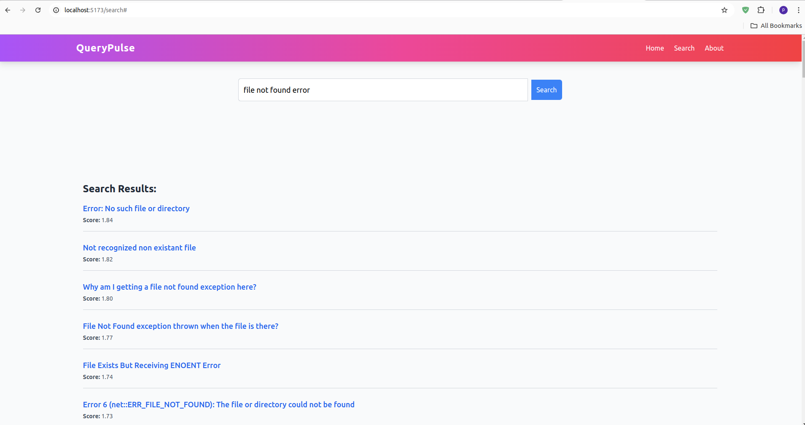

# QueryPulse

QueryPulse is a semantic Q&A search engine built to provide precise and time-efficient search and filtering capabilities using advanced NLP models and Elasticsearch embeddings. 


## Features
- Semantic search using NLP and Elasticsearch.
- Efficient indexing and data pipelines.
- Integration with a web interface.

---

## Demo
A demo video showcasing the application's features is available. Click the image below to view the demo vdo:

[](./demo/demo_recording.mp4)

## Setup and Installation

### Prerequisites
1. **Docker**: Ensure Docker is installed and running on your system.
2. **Node.js**: For running the frontend.
3. **Python**: Required for the backend setup.
4. **Elasticsearch**: Set up using Docker (see the guide below).

---

### Steps to Get Started

#### 1. Set Up Elasticsearch
Follow the tutorial to set up and start an Elasticsearch Docker container:
[Elastic Local Setup Guide](https://github.com/elastic/start-local)

- Note down the **username**, **password**, and **API key** during the setup.
- Start the container:
  ```bash
  ./start.sh
  ```
- Stop the container:
  ```bash
  ./stop.sh
  ```
#### 2. Clone the QueryPulse Repository

```bash
git clone https://github.com/Prashu7487/QueryPulse.git
cd QueryPulse
```
#### 3. Prepare Data
Move the data folder into the root of the QueryPulse directory:
```bash
mv /path/to/data ./QueryPulse/data
```

#### 4. Set Up the Backend
Navigate to the backend directory:
```bash
cd backend

# Create a virtual environment:
python -m venv venv
source venv/bin/activate  # For Linux/macOS

#Install required Python packages:
pip install -r requirements.txt
```
#### Create a .env file in the backend directory and add your details (e.g., API_KEY, Elasticsearch credentials):
```env
API_KEY=your_api_key
ELASTIC_USERNAME=your_username
ELASTIC_PASSWORD=your_password
```

#### 5. Index the Data (make sure ES container is running before this step)
Navigate back to the QueryPulse directory:
```bash
cd ..

# Run the indexing script to create and index documents:
python index_ES.py

Note: Ensure data/Questions.csv is available. Modify index_ES.py if required.
```

#### 6. Start the Backend Server
Activate the virtual environment (if not already activated):
```bash
cd backend
source venv/bin/activate  # For Linux/macOS

# Start the FastAPI server:
uvicorn main:app --reload
```

#### 7. Set Up the Frontend
Navigate to the frontend directory:

```bash
cd ../frontend

# Start the development server:
npm run dev
```


### Additional links for my future references:
https://github.com/elastic/start-local


